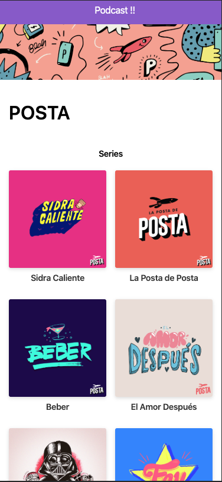

# App de podcsast mio 

App de podcast para mi curs ode NEXT:JS

## ¿Cómo funciona?

requiere Node.js 10 

* `npm install` para instalar las dependencias. 
* `npm run dev ` para el entorno de desarrollo. 
* `npm run build && npm start ` para el entorno de producción. 

## Licencia

MIT

